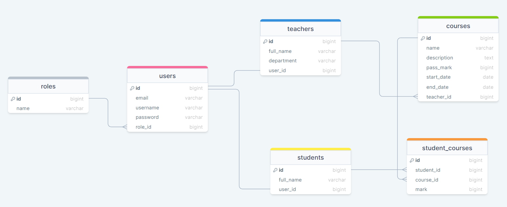

# Kassel Soft Task:

## ER Diagram:

## Tech stack:

(MERN) stack

## Instructions to run locally:

### Backend:

1. Create a new Mongodb database named "kassel-soft"
2. .env.example file is to reference the actual .env file
3. npm i to install required packages
4. command to run the backend: npm run dev

### Frontend:

1. .env.example file is to reference the actual .env file
2. npm i to install required packages
3. command to run the frontend: npm run dev

## Documentation

1. project implements RBAC and includes roles like (Administrator, Teacher, Student).
2. Admin is responsible for registering teachers.

## Live demo:

### login info:

1. Administrator:

##### username:

##### password:

2. Teacher:

##### username:

##### password:

3. Student:

##### username:

##### password:
